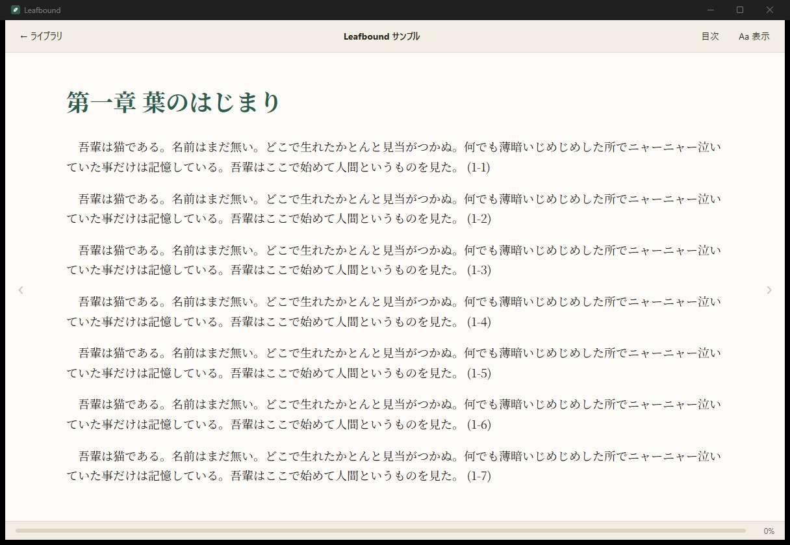

# Leafbound

A calm, open-source EPUB reader for Windows.
Windows 向けの、静かで軽い EPUB リーダーです。

Built with [Tauri 2](https://tauri.app/) (Rust) + React + TypeScript + [epub.js](https://github.com/futurepress/epub.js).



## Features / 機能

- EPUB 2 / EPUB 3 を開く(本はアプリ内ライブラリにコピーされます)
- 読書位置の自動保存と再開
- カテゴリによる本の整理(複数カテゴリ可)
- 表紙グリッド表示とリスト表示の切り替え
- 横読み(ページ送り)と縦読み(連続スクロール)
- 文字サイズ、フォント(プリセット + 任意のインストール済みフォント)、行間の調整
- 見開き表示(単ページ / 自動 / 見開き)
- 白 / セピア / 黒の配色
- UI 言語: 日本語 / English(既定はシステム言語に従う)
- 目次ジャンプ、ライブラリの検索、並び替え
- 本文内検索(Ctrl+F)
- ハイライト(4 色)とメモ。選択した文字から追加し、一覧からジャンプ
- エクスプローラーからの `.epub` ドラッグ＆ドロップ、ダブルクリックで開く(ファイル関連付け)

## Development / 開発

Prerequisites: Node.js 20+, Rust (stable, MSVC toolchain), Visual Studio Build Tools with the C++ workload, WebView2 (bundled with Windows 11).

```bash
npm install
npm run tauri dev
```

Production build (NSIS installer and MSI under `src-tauri/target/release/bundle/`):

```bash
npm run tauri build
```

Other scripts:

```bash
npm run typecheck   # TypeScript
cargo test --manifest-path src-tauri/Cargo.toml
```

Browser mode: `npm run dev` and open http://localhost:1420 in a browser.
Without the Tauri shell the app falls back to an in-memory mock backend with the
sample book pre-loaded, which is handy for UI work. Nothing is persisted there.

## Where data lives / データの保存場所

`%APPDATA%\dev.leafbound.app\`

- `library.json` – books, categories, reading progress, settings
- `books\` – imported EPUB copies
- `covers\` – extracted cover images
- `annotations\` – highlights and notes, one JSON file per book

Deleting a book from the library also deletes its copy. Original files are never touched.

## Project layout

```
src/            React frontend (library, reader, settings)
src-tauri/      Rust backend (library store, EPUB metadata, IPC commands)
scripts/        Icon generator
```

## Roadmap

- 複数ウィンドウ

縦書きの EPUB は、出版社の指定(`writing-mode: vertical-rl`)をそのまま表示します。

## License

MIT © racode246
