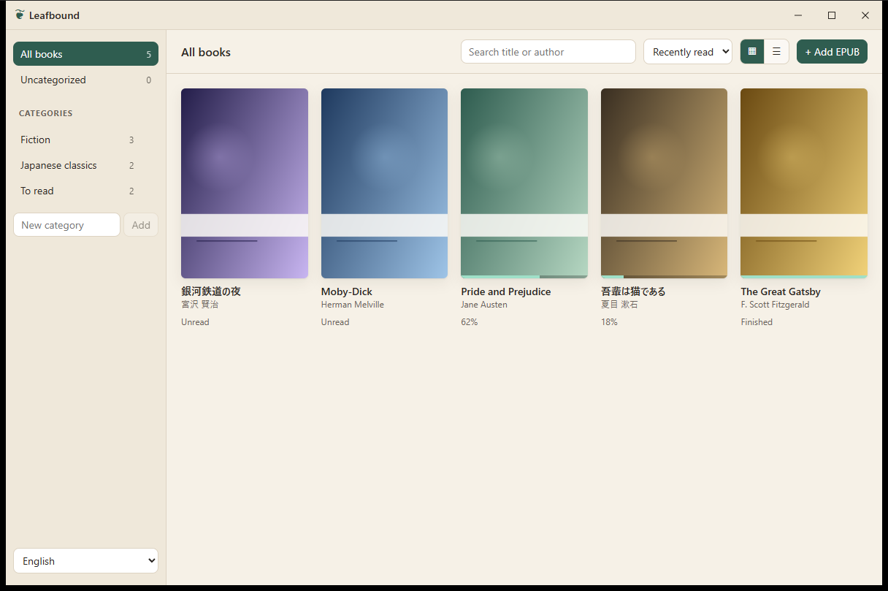

# Leafbound

A calm, open-source EPUB reader for Windows.

[日本語の README はこちら](README.ja.md)



Leafbound is built with [Tauri 2](https://tauri.app/) (Rust), React, TypeScript and [epub.js](https://github.com/futurepress/epub.js). It keeps your books in a local library, remembers where you stopped, and stays out of the way while you read.

## Features

- Opens EPUB 2 and EPUB 3 files. Books are copied into a local library; your original files are never modified.
- Remembers your reading position per book and resumes there.
- Categories for organizing the library. A book can belong to any number of categories.
- Cover grid or list view, search by title or author, and sorting by recently read, date added, title or author.
- Paged (horizontal) or continuous scrolling (vertical) reading.
- Single page, automatic or forced two-page spread.
- Font family (presets or any installed font), font size and line spacing.
- Light, sepia and dark color schemes.
- Table of contents, full-text search (Ctrl+F) and highlights in four colors with notes.
- Drag and drop EPUB files onto the window, or open them from Explorer through the `.epub` file association. Leafbound runs as a single instance.
- Interface in English and Japanese. The system language is used by default.
- Vertical Japanese text (`writing-mode: vertical-rl`) is rendered exactly as the publisher specified.
- Duplicate detection: importing the same file twice is skipped.

## Installation

There are no binary releases yet. Build an installer from source (see below); the NSIS installer and MSI are written to `src-tauri/target/release/bundle/`.

Requirements at runtime: Windows 10 or 11 with the WebView2 runtime (included in Windows 11).

## Keyboard shortcuts

| Key | Action |
|---|---|
| `→` `PageDown` `Space` | Next page |
| `←` `PageUp` | Previous page |
| `Ctrl+F` | Search in the book |
| `Esc` | Close the open panel |

Mouse wheel turns pages in paged mode.

## Building from source

Prerequisites:

- Node.js 20 or newer
- Rust (stable, `x86_64-pc-windows-msvc`)
- Visual Studio Build Tools 2022 with the "Desktop development with C++" workload
- WebView2 runtime (bundled with Windows 11)

```bash
npm install
npm run tauri dev      # run with hot reload
npm run tauri build    # produce the installer and MSI
```

Checks:

```bash
npm run typecheck
cargo test --manifest-path src-tauri/Cargo.toml
```

Browser mode: `npm run dev` and open http://localhost:1420 in a browser. Outside the Tauri shell the app falls back to an in-memory mock backend with a sample book, which is convenient for UI work. Nothing is persisted in that mode.

## Where your data lives

`%APPDATA%\dev.leafbound.app\`

| Path | Contents |
|---|---|
| `library.json` | Books, categories, reading progress and settings |
| `books\` | Imported EPUB copies |
| `covers\` | Extracted cover images |
| `annotations\` | Highlights and notes, one JSON file per book |

Removing a book from the library deletes its copy and annotations. Original files are not touched.

## Project layout

```
src/            React frontend: library, reader, settings, i18n
src-tauri/      Rust backend: library store, EPUB metadata and cover extraction, IPC commands
scripts/        Helpers: app icon, sample EPUB fixture, demo books for screenshots
```

## Roadmap

- Multiple windows

## Contributing

Issues and pull requests are welcome. Please run `npm run typecheck` and `cargo test` before opening a pull request. New user-facing strings go into both dictionaries in `src/i18n.tsx`.

## License

MIT © racode246
